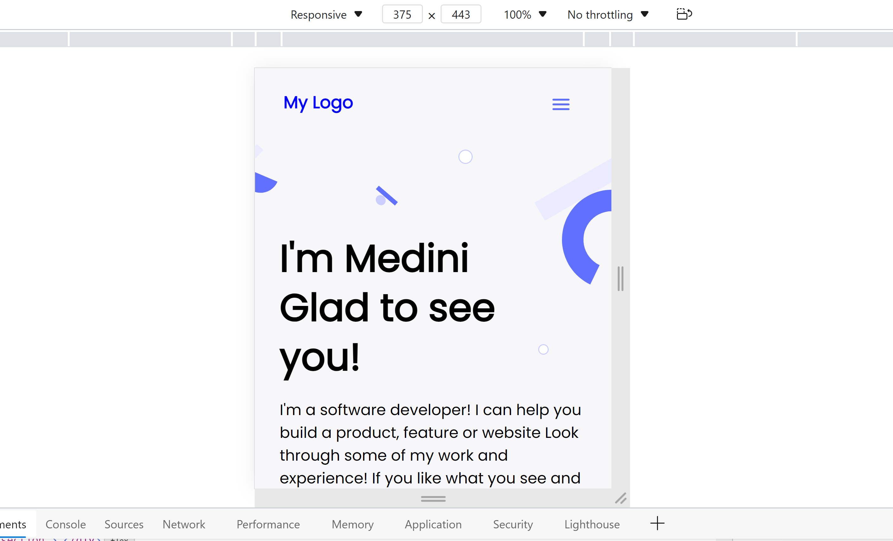

# Phase 2 Mobile Website Design

> In this project, the middle part of the website design like work section and framework, skills sections were designed.

Checked with linter errors and html technologies are used.

## Built With

- HTML, CSS, GitHub Pages
- WebHint, StyleLint packages are used to check for linter errors
- Visual Studio

## Live Demo

[Live Demo Link](https://livedemo.com)

## Setup 
- git clone https://github.com/Medini-Rajendra/project3_microverse.git
- cd into the folder
- git checkout work_branch
- open `index.html` with live server

## Authors

👤 **Rajendra Medini**
- GitHub: [@Medini-Rajendra](https://github.com/Medini-Rajendra)
- Twitter: [@invenire512](https://twitter.com/invenire512)
- LinkedIn: [LinkedIn](https://www.linkedin.com/in/medinichaitanya/)

## 📝 License

This project is [MIT](./MIT.md) licensed.
